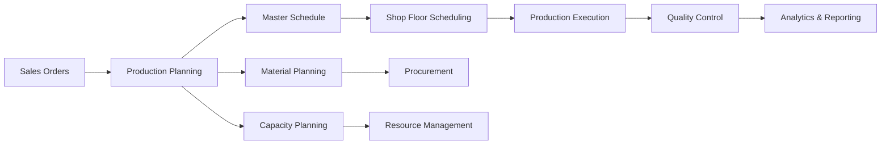

# Production Planning Module (08-production-planning)

## Overview

The **Production Planning Module** is an advanced manufacturing planning system designed for Industry 5.0 smart factories. It provides intelligent production scheduling, capacity planning, material requirements planning (MRP), and AI-driven optimization to maximize efficiency and minimize costs.

## Features

### Core Planning Capabilities
- **Master Production Schedule (MPS)**: Long-term production planning
- **Material Requirements Planning (MRP)**: Automated material planning
- **Capacity Requirements Planning (CRP)**: Resource capacity optimization
- **Shop Floor Scheduling**: Detailed production scheduling
- **Demand Planning**: Forecast-driven demand management

### Advanced Features
- **AI-Powered Optimization**: Machine learning for production optimization
- **Digital Twin Integration**: Real-time simulation and planning
- **Predictive Analytics**: Demand forecasting and trend analysis
- **Lean Manufacturing**: Just-in-time and continuous improvement
- **IoT Integration**: Real-time data from shop floor devices

## Architecture

### Technology Stack
- **Backend Framework**: NestJS with TypeScript
- **Database**: PostgreSQL + MongoDB for time-series data
- **AI/ML**: TensorFlow.js, ML algorithms for optimization
- **Real-time Processing**: WebSockets and Server-Sent Events
- **Message Queue**: Bull with Redis for job processing
- **API Documentation**: OpenAPI/Swagger

## Key Features

### Production Scheduling
- **Finite Capacity Scheduling**: Resource-constrained scheduling
- **Job Shop Scheduling**: Complex job routing and sequencing
- **Batch Processing**: Optimal batch sizes and scheduling
- **Preventive Maintenance**: Integrated maintenance scheduling
- **Multi-site Planning**: Cross-facility production planning

### Optimization Algorithms
- **Genetic Algorithms**: Production sequence optimization
- **Linear Programming**: Resource allocation optimization
- **Constraint Programming**: Complex constraint satisfaction
- **Simulated Annealing**: Local search optimization
- **Machine Learning**: Pattern recognition and prediction

## API Endpoints

### Production Plans
- `GET /api/production-planning/plans` - List production plans
- `POST /api/production-planning/plans` - Create production plan
- `PUT /api/production-planning/plans/:id` - Update production plan
- `POST /api/production-planning/plans/:id/optimize` - Optimize plan

### Schedules
- `GET /api/production-planning/schedules` - Get production schedules
- `POST /api/production-planning/schedules` - Create schedule
- `PUT /api/production-planning/schedules/:id` - Update schedule
- `POST /api/production-planning/schedules/:id/execute` - Execute schedule

### Resource Planning
- `GET /api/production-planning/capacity` - Get capacity information
- `POST /api/production-planning/capacity/analyze` - Analyze capacity
- `GET /api/production-planning/bottlenecks` - Identify bottlenecks
- `POST /api/production-planning/optimize-capacity` - Optimize capacity

## Business Logic

### Planning Process
1. **Demand Analysis**: Analyze customer demand and forecasts
2. **Capacity Planning**: Determine available production capacity
3. **Material Planning**: Calculate material requirements
4. **Schedule Generation**: Create optimal production schedules
5. **Optimization**: Apply AI algorithms for optimization
6. **Execution Monitoring**: Monitor plan execution
7. **Continuous Improvement**: Learn from execution data

### Integration Points
- **Sales Module**: Customer orders and demand forecasts
- **Inventory Module**: Material availability and stock levels
- **Manufacturing Module**: Production capabilities and constraints
- **Supply Chain Module**: Supplier delivery schedules
- **Quality Module**: Quality requirements and constraints

## Configuration

```typescript
@Module({
  imports: [
    TypeOrmModule.forFeature([
      ProductionPlan,
      Schedule,
      WorkOrder,
      Resource,
      Constraint,
    ]),
    MongooseModule.forFeature([
      { name: 'ProductionMetrics', schema: ProductionMetricsSchema },
    ]),
    BullModule.registerQueue({
      name: 'planning-optimization',
    }),
  ],
  controllers: [
    ProductionPlanController,
    ScheduleController,
    CapacityController,
  ],
  providers: [
    ProductionPlanService,
    SchedulingService,
    OptimizationService,
    CapacityPlanningService,
  ],
})
export class ProductionPlanningModule {}
```

## Optimization Algorithms

### Scheduling Algorithms
```typescript
interface SchedulingAlgorithm {
  name: string;
  optimize(jobs: Job[], resources: Resource[]): Schedule;
}

// Genetic Algorithm Implementation
class GeneticScheduler implements SchedulingAlgorithm {
  optimize(jobs: Job[], resources: Resource[]): Schedule {
    // Genetic algorithm implementation
    const population = this.initializePopulation(jobs, resources);
    
    for (let generation = 0; generation < this.maxGenerations; generation++) {
      const fitness = this.evaluateFitness(population);
      const selected = this.selection(population, fitness);
      const offspring = this.crossover(selected);
      const mutated = this.mutation(offspring);
      population = this.replacement(population, mutated);
    }
    
    return this.getBestSchedule(population);
  }
}
```

### Capacity Optimization
```typescript
class CapacityOptimizer {
  async optimizeCapacity(
    demand: Demand[],
    resources: Resource[],
    constraints: Constraint[]
  ): Promise<CapacityPlan> {
    // Linear programming model
    const model = this.createLPModel(demand, resources, constraints);
    const solution = await this.solveLPModel(model);
    
    return this.convertToCapacityPlan(solution);
  }
}
```

## AI/ML Integration

### Demand Forecasting
```typescript
@Injectable()
export class DemandForecastingService {
  async forecastDemand(
    historicalData: ProductionData[],
    externalFactors: MarketData[]
  ): Promise<DemandForecast> {
    const model = await this.loadOrTrainModel();
    const features = this.extractFeatures(historicalData, externalFactors);
    const forecast = model.predict(features);
    
    return {
      predictions: forecast,
      confidence: this.calculateConfidence(forecast),
      horizon: this.forecastHorizon,
    };
  }
}
```

### Production Optimization
```typescript
@Injectable()
export class ProductionOptimizationService {
  async optimizeProduction(
    currentPlan: ProductionPlan
  ): Promise<OptimizedPlan> {
    const constraints = await this.getConstraints();
    const objectives = await this.getObjectives();
    
    // Multi-objective optimization
    const optimizer = new MultiObjectiveOptimizer();
    const solutions = optimizer.optimize(currentPlan, constraints, objectives);
    
    return this.selectBestSolution(solutions);
  }
}
```

## Real-time Monitoring

### Production Metrics
- **Overall Equipment Effectiveness (OEE)**
- **Throughput and Cycle Time**
- **Resource Utilization**
- **Schedule Adherence**
- **Quality Metrics**

### Dashboard Features
- Real-time production status
- Capacity utilization charts
- Schedule variance analysis
- Bottleneck identification
- Performance trending

## Integration Architecture



## Performance Optimization

### Caching Strategy
```typescript
@Injectable()
export class PlanningCacheService {
  @Cacheable('production-plans')
  async getProductionPlan(id: string): Promise<ProductionPlan> {
    return this.planningService.findById(id);
  }
  
  @CacheEvict('production-plans')
  async invalidateProductionPlans(): Promise<void> {
    // Cache invalidation logic
  }
}
```

### Background Processing
```typescript
@Processor('planning-optimization')
export class OptimizationProcessor {
  @Process('optimize-schedule')
  async optimizeSchedule(job: Job<OptimizationJob>): Promise<void> {
    const { planId, constraints } = job.data;
    
    const optimizedSchedule = await this.optimizationService
      .optimizeSchedule(planId, constraints);
    
    await this.notificationService
      .notifyOptimizationComplete(optimizedSchedule);
  }
}
```

## Testing

### Test Coverage
- Unit Tests: 95%+
- Integration Tests: 90%+
- Algorithm Tests: 98%+
- Performance Tests: 85%+

### Testing Strategies
```bash
# Run all tests
npm run test

# Run optimization algorithm tests
npm run test:algorithms

# Run performance tests
npm run test:performance

# Run load tests
npm run test:load
```

## Deployment

### Environment Configuration
```env
# Planning Configuration
PLANNING_HORIZON_DAYS=90
OPTIMIZATION_TIMEOUT_MS=300000
MAX_CONCURRENT_OPTIMIZATIONS=3

# AI/ML Configuration
MODEL_UPDATE_INTERVAL=24h
FORECAST_ACCURACY_THRESHOLD=0.85

# Performance Configuration
CACHE_TTL_MINUTES=30
BATCH_SIZE=1000
```

### Monitoring
- Planning execution metrics
- Optimization performance
- Resource utilization
- Forecast accuracy
- System health checks

## License

This module is part of the Industry 5.0 ERP system and is licensed under the MIT License.

## Support

For technical support:
- Email: production-planning@ezai-mfgninja.com
- Documentation: https://docs.ezai-mfgninja.com/production-planning
- Issue Tracker: https://github.com/ezai-mfg-ninja/industry5.0-production-planning/issues
